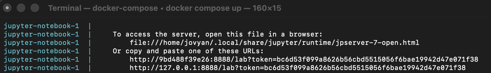

# Wine Classification
Contributors/Authors
- Prabuddha Tamhane (PAT0216)
- Harrison Li (Harrisonlee0530)
- Shihan Xu (shihan66)
- Wesley Beard (Beardw)

## About
This project illustrates how our team endeavoured to build a classification model to predict whether a wine was red or white based on a set of wine quality features (ex. pH, residual sugars, etc.).  Four models were investigated with the best one being RBF SVM. It performed extremely well on our test data, with an accuracy of 0.9969 and f1 score of 0.9979. While there were still false positives and false negatives, indicated by the scores being less than one, this is not of great concern to us. Since we are not dealing with life-threatening or possible adverse outcomes should a prediction be incorrect, the high level of precision in our model has given us confidence to use it in production.

The dataset used in this project was an amalgamation of two datasets related to wine from the northern region of Portugal: specifically, Vinho Verde red and white samples. Each row represents a wine sample with 11 different features including pH, residual sugar, density etc. The datasets were distinguished by being either for red or white wines. It was created by Paulo Cortez, A. Cerdeira, F. Almeida, T. Matos, and J. Reis and can be sourced from the UC Irvine Machine Learning Repository [here](https://archive.ics.uci.edu/dataset/186/wine+quality).

## Report
The final report can be found [here](https://pat0216.github.io/wine-classification/reports/wine_classifier.html).

## Dependencies
* [Docker](https://www.docker.com/)
* Workspace - Possible options: [Jupyter](https://jupyter.org/) and [Visual Studio Code](https://code.visualstudio.com/download)
* If using VS Code - [Jupyter extension](https://marketplace.visualstudio.com/items?itemName=ms-toolsai.jupyter)

## Usage
### Setup
1. Ensure that Docker Desktop is running. (This is for Windows or Mac computers.)
2. Clone this GitHub repository to a directory of your choice.

### Running the analysis
1. To begin running this report, navigate to the root directory of this project.
2. Enter the following command in your terminal.
```
docker compose up
```
3. Several lines will appear. Find the line that begins with `http://127.0.0.1:8888/lab?token=`.
   
4. Copy and paste the entire line into a browser of your choice. The project will load and be accessible.
5. Reset the project by navigating to the root directory using a terminal window within the container.
6. Run the following command to remove all previously-generated files.
```
make clean
```
7. Enter the following command to run the analysis in its entirety.
```
make all
```
Note: there are additional `make` commands that run portions of the analysis: test, data, eda, analysis, and report.

### Clean up
Once the container is no longer needed, it can be shut down.
1. Use `Ctrl` + `C` to stop in the terminal.
2. Type `docker compose rm` to shut down and clean up the resources used by the container.

## License
The Wine Classification report, code, and additional documentation within this repository are licensed under the MIT license.

## References
Cortez, P., Cerdeira, A.L., Almeida, F., Matos, T., & Reis, J. (2009). Modeling wine preferences by data mining from physicochemical properties. Decis. Support Syst., 47, 547-553.

Cortez, P., Cerdeira, A., Almeida, F., Matos, T., & Reis, J. (2009). Wine Quality [Dataset]. UCI Machine Learning Repository. https://doi.org/10.24432/C56S3T.

Pedregosa, F., Varoquaux, G., Gramfort, A., Michel, V., Thirion, B., Grisel, O., Blondel, M., Prettenhofer, P., Weiss, R., Dubourg, V., Vanderplas, J., Passos, A., Cournapeau, D., Brucher, M., Perrot, M., & Duchesnay, E. (2011). Scikit-learn: Machine Learning in Python. *Journal of Machine Learning Research*, *12*, 2825–2830.

VanderPlas et al., (2018). Altair: Interactive Statistical Visualizations for Python. Journal of Open Source Software, 3(32), 1057, https://doi.org/10.21105/joss.01057
