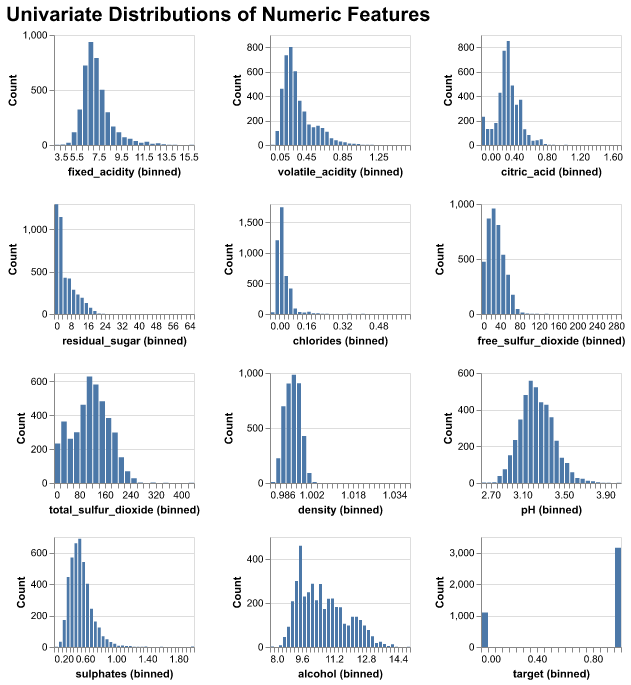
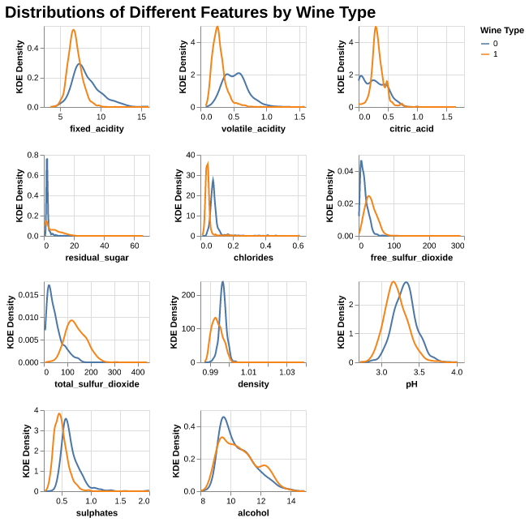
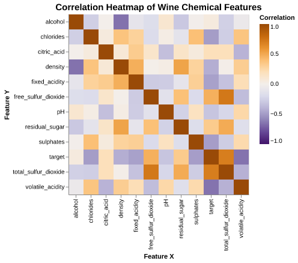

# Summary
This project illustrates how our team endeavoured to build a classification model to predict whether a wine was red or white based on a set of wine quality features (ex. pH, residual sugars, etc.).  Four models were investigated with the best one being RBF SVM. It performed extremely well on our test data, with an accuracy of 0.9969 and f1 score of 0.9979. While there were still false positives and false negatives, indicated by the scores being less than one, this is not of great concern to us. Since we are not dealing with life-threatening or possible adverse outcomes, should a prediction be incorrect, the high level of precision in our model has given us confidence to use it in production.

# Introduction
Red or white? This is a question that countless dinner guests are asked every evening. Some know exactly what they like and others are more open to exploring something new and exciting. And just like the consumer, wine producers have a vested interest in this question. However, they aren’t looking at the wine through a glass, but at the very chemistry that makes up each and every nuanced flavour. They are asking: What does the chemistry say this wine is?
Our goal in this analysis is to see if we can develop a machine learning model to predict whether a wine will be classified as either white or red, based on a sample of wine chemical characteristics. This would allow the industry to be able to confirm their wines not only on a visual aspect but on a chemical level as well.
There may be a time that industry producers, small and large-alike, want to dive into how their wines measure up when compared to others. This could be confirming what is already known or helping to make that key distinction when a winemaker creates a blend of white and red and would like to know how best to market their product.
For example, it may be the case that a wine visually looks like a red, but that may not mean it chemically acts like one. Our model will be able to make that distinction and report back what the chemistry says.
Of course, there may be classifications that don’t align with what the wine is visually or the goal of the winemaker. In these cases, it may be due to variation in the model and the prediction probability not being reasonably high for either a red or white. While this may be seen as a disadvantage, it could also provide additional insights regarding the chemical quality of the wine in question. (I.e. It could be produced as a white wine, but with some underlying qualities of red wine.) 
With a proper understanding of our model, the input data, and final prediction, we hope that it will provide the wine industry with another way of viewing and marketing their product to the next couple dining out.

# Data
We are using a dataset of wine quality for wines from the northern region of Portugal (@wine_data, originally described in @wine_paper) that consists of several chemical features: fixed acidity, pH, citric acid, sulphates, residual sugar and several others.
## Data Wrangling
To prepare for data analysis, we:
- combined the red and white wine datasets into a single dataframe,
- remove the *quality* variable to avoid data leakage,
- standardized column names,
- created a categorical `wine_type` variable (red vs. white),
- created a binary `target` variable (0 = red, 1 = white).
We confirmed that the dataset contains no missing values and falls within the expected measurement ranges described in @wine_paper.
Finally, the data were randomly split into training and test sets.
```{python}
```
## Data Validation
Before conducting analysis, we performed a series of validation checks to ensure data quality:
- verified the presence of all expected variables,
- confirmed the absence of missing values,
- checked for duplicate rows and removed them when present,
- validated numerical ranges using domain knowledge from @wine_paper,
- ensured that the `wine_type` and `target` variables contained only valid categories,
- ensured that no feature-feature anomalous correlation and target-feature anomalous correlation exists.
These checks ensured the dataset was clean, consistent, and suitable for modelling.

# Methods
All models were implemented using the scikit-learn library (@scikit-learn), and Altair (@altair) was used for visualizations. The analysis makes use of NumPy (@numpy) for numerical computations.

```{python}
#| echo: false
import numpy as np
from IPython.display import Markdown
if not hasattr(np, "Inf"):
    np.Inf = np.inf
import warnings
warnings.simplefilter(action='ignore', category=FutureWarning)
import pandas as pd
import altair as alt
from sklearn.model_selection import train_test_split
from sklearn.svm import SVC
import matplotlib.pyplot as plt
from sklearn.dummy import DummyClassifier
from sklearn.metrics import confusion_matrix, ConfusionMatrixDisplay
from sklearn.tree import DecisionTreeClassifier
from sklearn.neighbors import KNeighborsClassifier
from sklearn.linear_model import LogisticRegression
from sklearn.compose import make_column_transformer
from sklearn.pipeline import Pipeline, make_pipeline
from sklearn.preprocessing import StandardScaler
from sklearn.impute import SimpleImputer
from sklearn.model_selection import (
    cross_validate,
    train_test_split,
    cross_val_predict
)
import os
import pandera.pandas as pa
os.environ["DISABLE_PANDERA_IMPORT_WARNING"] = "True"
from pandera.errors import SchemaErrors
import deepchecks
from deepchecks.tabular import Dataset
from deepchecks.tabular.checks import FeatureLabelCorrelation, FeatureFeatureCorrelation
```

# Exploratory Data Analysis
This section summarizes the data structure and important statistical properties that are related to the features of this wine classification project.

## Data Structure
From @tbl-data-summary, there are some key observations:
- **Residual sugar**, **free sulfur dioxide**, and **total sulfur dioxide** have wide ranges and right-skewed distributions with extreme outliers.
- **pH**, **alcohol**, **density**, **chlorides** and **critic acid** have small standard deviations, showing relatively tight distributions.
These statistics provide insight into which variables may separate wine types well.
From @tbl-data-structure, 11 numerical features with no missing values, which confirms that the dataset is clean and ready for analysis.

```{python}
#| label: tbl-data-summary
#| tbl-cap: Summary statistics for all numerical features in the wine dataset.

data_summary_table = pd.read_csv("../results/tables/data_summary.csv")
Markdown(data_summary_table.to_markdown(index=False))
```

```{python}
#| label: tbl-data-structure
#| tbl-cap: Summary of dataset structure, including feature names, entries, null values, and data types.

data_structure_table = pd.read_csv("../results/tables/data_info.csv")
Markdown(data_structure_table.to_markdown(index=False))
```
## Overall Univariate Distributions

{#fig-univariate-dist width=50%}

We can see from @fig-univariate-dist, many features (e.g. **residual sugar**, **chlorides**, **sulphates**) show right-skewness, which means most wines fall in lower ranges with a few extreme values, whereas **alchohol** is slightly right-skewed, the distribution of **density** and **pH** are similar to Normal distribution.

## Distributions of Features by Wine Type

{#fig-kde-dist width=50%}

From @fig-kde-dist, we can see differences between red (0) and white (1) wine:
- Overall, most features for both wine types show **strongly right-skewed distributions**. The distribution of **pH** looks close to bell-shaped. For pH, the **red wines have higher pH than white wines**, so the whites are more acidic.
- For **fixed_acidity**, **volatile_acidity**, **citric_acid**, **chlorides**, and **sulphates**, the **white wines have higher density at the lower end of the scale**, so whites here look "lighter" and cleaner on these chemistry dimensions.
- **Alcohol** levels tend to be higher in **red wines**, while white wines peak at slightly lower alcohol values. Combined with their higher pH, this suggests that whites are lighter but sweeter and more acidic.

## Pairwise Correlations

{#fig-correlation width=50%}

From @fig-correlation, we can observe some overall correlation patterns:
- **Density** is strongly positively correlated with **residual sugar**, and **free sulfur dioxide** is strongly correlated with **total sulfur dioxide**.
- **Alcohol** is negatively correlated with **density**, consistent with wine chemistry.
- **pH** is negatively correlated with **fixed acidity**, showing the expected inverse relationship.

# Modeling
## Data Splitting
First, we splited the data into training and testing sets. Meanwhile, the `wine_type` column has been encoded into the binary `target` variable and was therefore removed. Then, the resulting dataset was separated into feature dataframe and the target vector for use in modeling the steps.

## Pipeline
Since all predictors are numerical and models such as KNN and SVMs are distance-based, `StandardScaler` from sklearn was applied to all those features so as to ensure all features have equal weights in the model.

## Model Comparison
Overall, most classifiers achieved strong predictive performance, except for the `DummyClassifier`, which is expected, since it is a baseline that does not use feature information.
Among all those evaluated models, the **RBF-SVM** achieved the highest validation performance and showed the smallest variability across folds, indicating a strong balance between accuracy and stability.
This suggests that **non-linear decision boundaries** may better capture the structure of the one classification compared to linear methods. 

```{python}
#| label: tbl-result-df
#| tbl-cap: Cross-validated performance metrics for all evaluated classification models, including mean fit time, score time, training accuracy, and test accuracy with standard deviations across folds.

corss_valid_df = pd.read_csv("../results/tables/.csv")
Markdown(corss_valid_df.to_markdown(index=False))
```

# Results
## Confusion Matrix
To further evaluate model behavior, we examined the confusion matrices for each classifier. These matrices provide a detailed view of how well each model distinguishes between red wine (label = 0) and white wine (label = 1).
Overall, all machine learning models—except the DummyClassifier—achieve very strong separation between the two classes:
- **Decision Tree, KNN, RBF SVM, and Logistic Regression** all show very low wrong counts for both classes.
- **RBF SVM** performs especially well, producing near-perfect predictions with only a small number of false positives and false negatives.

These results show that those models are highly capable of distinguishing between wine types, with **RBF SVM providing the most consistent and accurate classification**.

## Test Scoring
We next evaluated each model on the test set using **accuracy, recall, precision, and F1 score**. These metrics allow us to assess the generalization performance of each classifier beyond the training data.
The results show a clear trend:
- The **DummyClassifier** performs the worst, with accuracy around 0.75 and substantially lower precision and F1.
- **Decision Tree, KNN, and Logistic Regression** all perform well, achieving accuracy scores above 0.97 and balanced precision/recall values.
- **RBF SVM** outperforms all other models, achieving the highest scores in accuracy, recall, precision, and F1—demonstrating excellent predictive capability and strong generalization.


# Discussion
We found that all of the models that we tested preformed much better than our Dummy Classifier. Subsequently, comparing our models individually, each one performed well. However, the model that had the highest cross-validation score was RBF SVM at 0.9952. Since all models scored high (>0.99), we included them in calculating accuracy, recall, precision and f1 on our test data. Here again, we see RBF SVM performing the best with the highest scores in each one of these metrics (0.9969, 0.9989, 0.9969, and 0.9979 respectively).

The metric of focus for our analysis was accuracy. Our primary aim was to ensure that we were correctly predicting whether or not a wine was red or white. Although we were looking towards accuracy, we can also see from our confusion matrices that the test recall and precision scores were high resulting in the lowest false positives and false negatives (20 and 5, during training). While our model was not being explicitly optimized regarding precision and recall, having these relatively small incorrect predictions from our training data and higher test scores adds to the robustness and our confidence of the model.

All four of our potential models exceeded our expectations. We expected them to do well, however, were pleased with the final results and scoring. There were some key features that led us to expect at least one well performing model. These were highlighted during our Exploratory Data Analysis and can be seen in our Distributions of Different Features by Wine Type and Pairwise Correlations visualizations. By analyzing the various density plots, we were able to see that there were several noticeable differences between red and white wines for several different features. There appeared to be several distributions with varying levels of overlap that increased our confidence that any potential model would be able to correctly predict red or white with a reasonable level of accuracy. For example, we saw different distributions for the volatile acidity and pH features. Our pairwise correlations showed a varying level of correlations among all the different features. This was an interesting part of the analysis as highly correlated free sulfur dioxide and sulfates made sense, while the negatively correlated alcohol and density got us to think deeper into the chemical nature of the wine.

These findings allow us to present a model that we can offer to winemakers and industry stakeholders to use in their business needs. Without having to spend the resources and time to create new wine products, a business can focus on the important features and from there decide on what wine to produce. For example, if a business was interested in making and marketing a wine that was low sugar and low in acidity (along with the other features), our model would help determine the type that should be produced. This is in addition to using the model to predict what type of wine an already produced wine is.

Our current analysis was only for the classification between two different types of wine: red and white. It would be interesting to see if we could expand this to include additional types of wine. We could look at including quality data for rose and sparkling wines. Additionally, if this new model worked well, it would be interesting to see if we could further generalize and make an all-purpose model that could be used to predict different types of alcohols based solely on chemical quality composition. This could possibly be useful, not only in the liquor industry, but in tangential industries that rely on models to predict unknown substances from a sample. (For example, forensics comes to mind.)

# References
